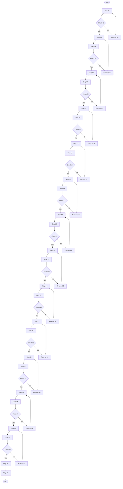

# Long Flowchart Export Demo

```mermaid
flowchart TD
    S([Start]) --> N01[Step 01]
    N01 --> N02{Check 02}
    N02 -- Yes --> N03[Step 03]
    N02 -- No --> R02[Recover 02]
    R02 --> N01
    N03 --> N04[Step 04]
    N04 --> N05{Check 05}
    N05 -- Yes --> N06[Step 06]
    N05 -- No --> R05[Recover 05]
    R05 --> N03
    N06 --> N07[Step 07]
    N07 --> N08{Check 08}
    N08 -- Yes --> N09[Step 09]
    N08 -- No --> R08[Recover 08]
    R08 --> N06
    N09 --> N10[Step 10]
    N10 --> N11{Check 11}
    N11 -- Yes --> N12[Step 12]
    N11 -- No --> R11[Recover 11]
    R11 --> N09
    N12 --> N13[Step 13]
    N13 --> N14{Check 14}
    N14 -- Yes --> N15[Step 15]
    N14 -- No --> R14[Recover 14]
    R14 --> N12
    N15 --> N16[Step 16]
    N16 --> N17{Check 17}
    N17 -- Yes --> N18[Step 18]
    N17 -- No --> R17[Recover 17]
    R17 --> N15
    N18 --> N19[Step 19]
    N19 --> N20{Check 20}
    N20 -- Yes --> N21[Step 21]
    N20 -- No --> R20[Recover 20]
    R20 --> N18
    N21 --> N22[Step 22]
    N22 --> N23{Check 23}
    N23 -- Yes --> N24[Step 24]
    N23 -- No --> R23[Recover 23]
    R23 --> N21
    N24 --> N25[Step 25]
    N25 --> N26{Check 26}
    N26 -- Yes --> N27[Step 27]
    N26 -- No --> R26[Recover 26]
    R26 --> N24
    N27 --> N28[Step 28]
    N28 --> N29{Check 29}
    N29 -- Yes --> N30[Step 30]
    N29 -- No --> R29[Recover 29]
    R29 --> N27
    N30 --> N31[Step 31]
    N31 --> N32{Check 32}
    N32 -- Yes --> N33[Step 33]
    N32 -- No --> R32[Recover 32]
    R32 --> N30
    N33 --> N34[Step 34]
    N34 --> N35{Check 35}
    N35 -- Yes --> N36[Step 36]
    N35 -- No --> R35[Recover 35]
    R35 --> N33
    N36 --> N37[Step 37]
    N37 --> N38{Check 38}
    N38 -- Yes --> N39[Step 39]
    N38 -- No --> R38[Recover 38]
    R38 --> N36
    N39 --> N40[Step 40]
    N40 --> E([End])
```
